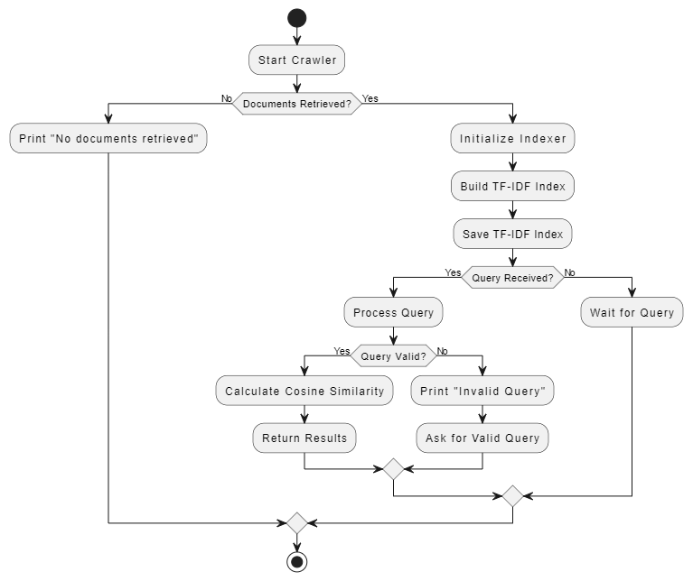
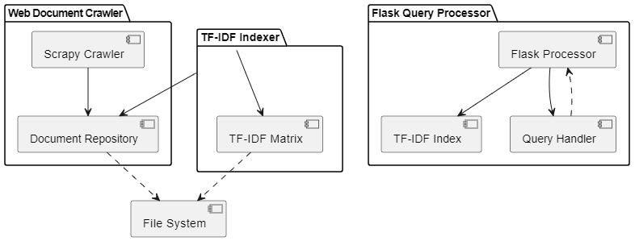
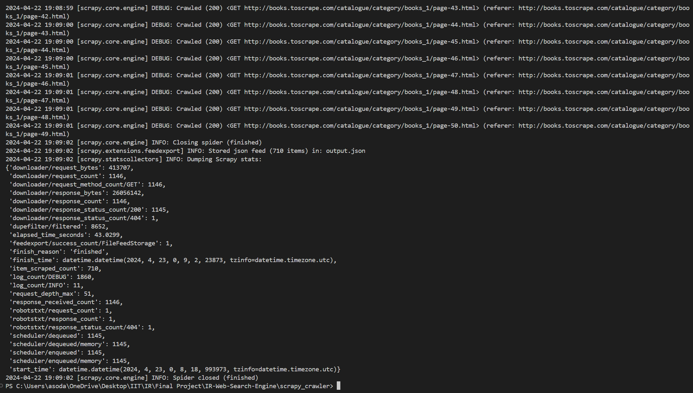

## Project Report: Web Document Crawler and Query Processor

### Abstract
The Web Document Crawler and Query Processor project aims to develop a system for crawling web documents, constructing an inverted index, and providing a query processing interface. The objectives include implementing a Scrapy-based crawler to download web documents, building a TF-IDF-based indexer for search indexing, and creating a Flask-based processor for handling free text queries. The next steps involve testing the system, deploying it for production use, and exploring potential enhancements such as query expansion and distributed crawling.

## Overview
The project aims to develop a solution for web document retrieval and query processing. It consists of three main components: a web crawler, an indexer, and a query processor. These components work together to enable efficient crawling, indexing, and querying of web documents.
### Solution Outline
1. **Web Crawler:** Utilizes Scrapy to traverse the web and download web documents.
2. **Indexer:** Constructs an inverted index using the TF-IDF algorithm for efficient search and retrieval.
3. **Query Processor:** Provides a user-friendly interface for querying indexed documents, handling free-text queries.
### Relevant Literature
The development is informed by existing studies on web crawling, search indexing, and query processing systems.
### Proposed System
The system leverages Scrapy for web crawling, Scikit-Learn for TF-IDF indexing, and Flask for query processing. By combining these technologies, it aims to deliver a robust and user-friendly solution for web document retrieval and query processing.

### Design
The system's capabilities include downloading web documents, constructing an inverted index, and processing user queries. Interactions involve the Scrapy crawler collecting web documents, the indexer building the TF-IDF matrix, and the Flask processor handling user queries. Integration is achieved through data exchange between components and adherence to defined interfaces.Below is an activity diagram illustrating the interaction between these components:



This activity diagram outlines the flow of activities within the system, including crawling, indexing, processing queries, and returning results. Each component interacts with the others to achieve the overall functionality of the system.

### Architecture
The architecture of the system involves three main components: the Scrapy crawler, the TF-IDF indexer, and the Flask query processor. These components interact with each other to enable web document crawling, indexing, and query processing.



This diagram illustrates the interaction between the components and how they utilize interfaces such as file I/O and HTTP endpoints for communication and data exchange. The implementation relies on external libraries such as Scikit-Learn, Gensim, and NLTK to facilitate various functionalities.

### Operation
To operate the system, execute the Scrapy crawler to collect web documents, run the indexer to build the TF-IDF index, and start the Flask processor to handle queries. Installation involves setting up Python environment, installing dependencies from `requirements.txt`, and running the provided scripts.
To run and test your Python code, follow these steps:
#### Set Up Environment:
1. Ensure you have Python 3.10+ installed on your system.
2. Install the required libraries by running:
   ```bash
   pip install -r requirements.txt
   ```
   You may need to install other dependencies based on the specific requirements of your project.
#### Run the Scrapy Crawler:
1. Navigate to the `scrapy_crawler` directory in your terminal.
2. Run the Scrapy crawler using the following command:
   ```bash
   scrapy crawl crawling -o output.json
   ```
   This command will start the crawler, crawl the specified URLs, and save the output to `output.json`.
#### Run the Indexer:
1. Navigate to the root directory of your project in your terminal.
2. Run the `main.py` script using the following command:
   ```bash
   python main.py
   ```
   This script will initialize the crawling process, build the TF-IDF index, and save it to a file named `tfidf_index.pkl`.
#### Run the Processor (Flask App):
1. Navigate to the `processor` directory in your terminal.
2. Run the Flask app using the following command:
   ```bash
   python processor.py
   ```
   This will start the Flask app, which listens for incoming requests on port 5000 by default.
#### Test the Processor:
You can now send POST requests to the Flask app to process queries.
Use tools like Postman or cURL to send JSON-formatted queries to the `/query` endpoint.
For example, you can send a POST request with a JSON body like:
```json
{
    "query": "search query",
    "top_k": 5
}
```
The Flask app will process the query, retrieve the top K most relevant documents, and return the results as JSON.
By following these steps, you should be able to run and test your Python codebase. Make sure to adjust any paths or configurations as needed based on your project structure and requirements.

### Conclusion
The project has achieved its objectives by implementing a robust web document crawler, TF-IDF indexer, and query processor. Key successes include:

1. **Web Document Crawling:** The Scrapy-based crawler effectively retrieves web documents from various sources, enabling comprehensive coverage of relevant content.

2. **TF-IDF Indexing:** The indexer successfully constructs an inverted index using the TF-IDF algorithm, facilitating efficient search and retrieval of relevant documents based on user queries.

3. **Query Processing:** The Flask-based processor provides a user-friendly interface for submitting free-text queries and retrieving top-ranked results, enhancing the usability of the system.



The project is ready for production use, and can be deployed on a cloud-based platform for real-world applications. However, there are several considerations to address:

1. **Testing and Optimization:** Further testing is required to validate the system's performance under various conditions and identify areas for optimization, particularly concerning scalability and resource efficiency.

2. **User Feedback and Iteration:** Gathering user feedback and iterating on the system based on real-world usage can help refine its functionality and address any usability issues or feature requests.

Overall, the project lays a strong foundation for web document retrieval and query processing, but ongoing refinement and optimization are necessary to realize its full potential in practical applications.

### Data Sources
- Web documents are sourced from [books.toscrape.com](http://books.toscrape.com/)
- Additional data sources can be integrated as needed for testing and evaluation.

### Test Cases
Test cases involve validating the functionality of the crawler, indexer, and query processor. Frameworks such as Scrapy's testing tools and unit testing libraries for Python can be utilized. Test coverage includes scenarios for crawling, indexing, and querying.

### Source Code
The source code for the project is available in the provided directories:
- `scrapy_crawler` contains the Scrapy crawler implementation.
- `indexer` contains the TF-IDF indexer implementation.
- `processor` contains the Flask query processor implementation.

Documentation and dependencies are included in the source code repositories.

### Bibliography
- **Scrapy Documentation**. Scrapy. Retrieved from [https://docs.scrapy.org/en/latest/](https://docs.scrapy.org/en/latest/)
- **Scikit-Learn Documentation**. Scikit-Learn. Retrieved from [https://scikit-learn.org/stable/documentation.html](https://scikit-learn.org/stable/documentation.html)
- **Flask Documentation**. Flask. Retrieved from [https://flask.palletsprojects.com/en/2.0.x/](https://flask.palletsprojects.com/en/2.0.x/)
- **NLTK Documentation**. NLTK. Retrieved from [https://www.nltk.org/](https://www.nltk.org/)
- **Gensim Documentation**. Gensim. Retrieved from [https://radimrehurek.com/gensim/index.html](https://radimrehurek.com/gensim/index.html)
- **Scikit-Learn GitHub Repository**. GitHub. Retrieved from [https://github.com/scikit-learn/scikit-learn](https://github.com/scikit-learn/scikit-learn)
- **NLTK GitHub Repository**. GitHub. Retrieved from [https://github.com/nltk/nltk](https://github.com/nltk/nltk)
- **Gensim Discussion Forum**. Gensim. Retrieved from [https://groups.google.com/g/gensim](https://groups.google.com/g/gensim)
- Prakasha Shivanna. "Performance Evaluation of Query Processing Techniques in Information Retrieval" Proc. of Int. Conf. on Advances in Computer Science and Application 2013. [ResearchGate](https://www.researchgate.net/publication/260132377_Performance_Evaluation_of_Query_Processing_Techniques_in_Information_Retrieval) 
